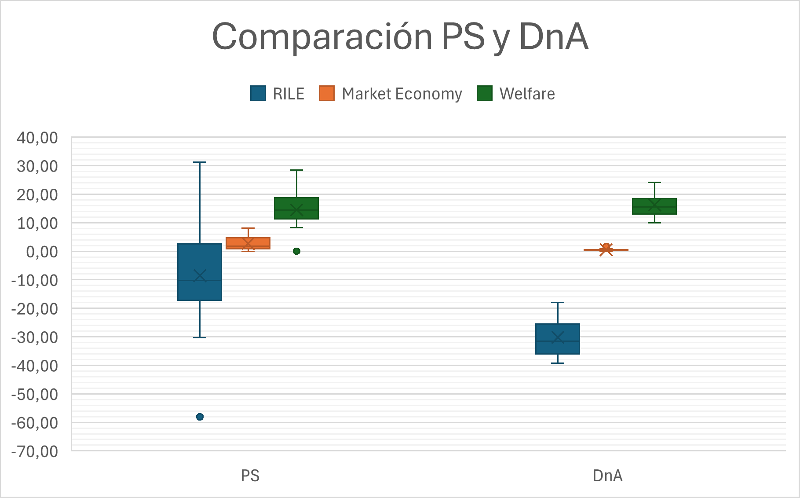
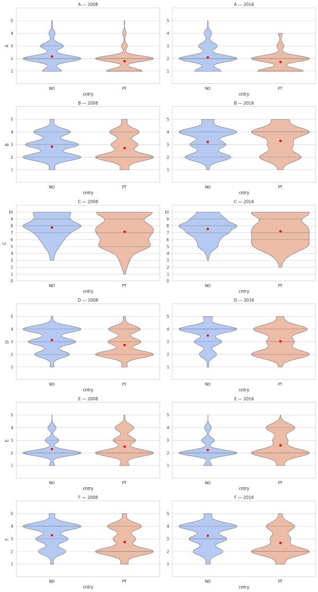
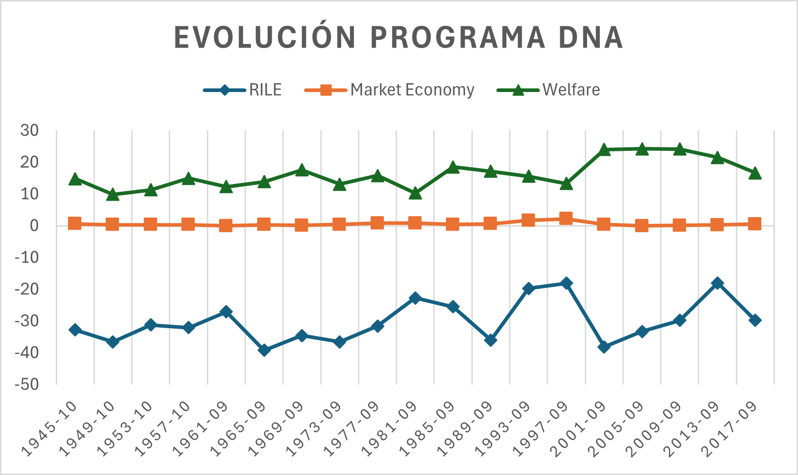
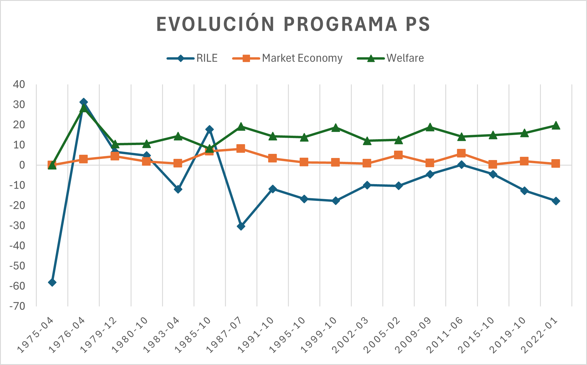
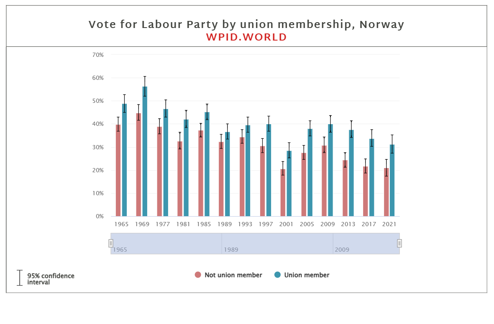
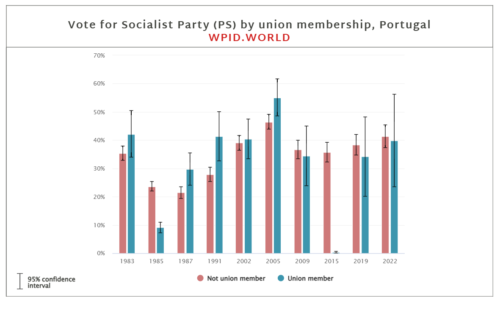

# Social Democracy Across Two Latitudes  
## Ideological Differences and Voter Profiles in Norway (DnA) and Portugal (PS)

This repository contains the code and analytical workflow for a comparative political science project investigating how social democracy differs between a Nordic and a Mediterranean context. The study focuses on **Norway (Det norske Arbeiderparti, DnA)** and **Portugal (Partido Socialista, PS)**, examining both **party ideological positioning** and **the profile of their electorates**.
> **_NOTE:_** Original investigation was written in Spanish
---

## Table of Contents
- [Project Overview](#project-overview)
- [Research Question](#research-question)
- [Hypotheses](#hypotheses)
- [Theoretical Background](#theoretical-background)
- [Data Sources](#data-sources)
- [Methodology](#methodology)
- [Key Findings](#key-findings)
- [Limitations](#limitations)
- [References](#references)
- [Appendix](#appendix)

---

## Project Overview

Social democracy is often treated as a coherent ideological family across Europe. However, historical institutionalism and welfare state literature suggest that social democratic parties may diverge significantly depending on structural and contextual factors such as:

- welfare state architecture,
- labor market regulation,
- union density and bargaining institutions,
- exposure to international economic pressures,
- crisis management strategies (1970s oil shocks, 2008 financial crisis).

This project tests whether the Norwegian and Portuguese social democratic parties (DnA and PS) exhibit meaningful differences both in their **programmatic supply** and in the **attitudes of their voters**.

---

## Research Question

**What distinguishes Nordic social democracy from Mediterranean social democracy?**

This research addresses the question by comparing Norway and Portugal through three complementary empirical lenses:
1. Party manifestos
2. Electoral coalitions
3. Survey-based welfare attitudes

---

## Hypotheses

**H1:** Norwegian social democracy presents more progressive (left-wing) electoral programs than Portuguese social democracy.

**H2:** The Portuguese social democratic electorate is more favorable to neoliberal economic attitudes than the Norwegian one.

---

## Theoretical Background

This study builds on welfare regime theory and comparative political economy literature.

A key reference point is Esping-Andersen’s typology of welfare capitalism, which classifies Nordic welfare states as social democratic regimes characterized by high decommodification and universalism. Subsequent scholarship introduced the Mediterranean welfare regime, typically described as more familialist, fragmented, and less redistributive.

The project assumes that these structural differences affect:

- party ideological strategies (especially in economic policy),
- the role of unions and collective bargaining,
- voter expectations and trust in redistribution mechanisms,
- party responses to economic crises.

The Nordic model is associated with stronger labor institutions and universal welfare provision, while the Mediterranean model is often characterized by lower union density, weaker redistributive capacity, and higher labor market insecurity.

---

## Data Sources

This project uses three quantitative datasets:

### 1) Manifesto Project Database (MPD)
Used to analyze the programmatic evolution of PS and DnA through time.

Key MPD indicators:
- **RILE**: ideological position (-100 extreme left to +100 extreme right)
- **Market economy**: emphasis on liberalization and orthodox economic policy
- **Welfare**: emphasis on welfare state expansion and equality

### 2) World Political Cleavages and Inequality Database (WPID)
Used to examine long-term changes in the social profile of party electorates.

Key WPID indicators:
- union membership and vote patterns
- income-based voting trends (e.g., support among top 10% income)

### 3) European Social Survey (ESS)
Used to compare welfare attitudes among PS and DnA voters.

Rounds analyzed:
- ESS Round 4 (2008)
- ESS Round 8 (2016)

After filtering by vote choice, sample sizes were:
- **2008:** 465 Portuguese + 393 Norwegians (N = 858)
- **2016:** 262 Portuguese + 394 Norwegians (N = 656)

Selected survey variables:

- **A:** Government should reduce income differences (1 strongly agree – 5 strongly disagree)
- **B:** Large income differences are acceptable to reward talent and effort (1–5)
- **C:** Standard of living of the unemployed is government’s responsibility (0–10)
- **D:** Social benefits are too costly for businesses (1–5)
- **E:** Social benefits lead to a more equal society (1–5)
- **F:** Social benefits make people less willing to work / harm the economy (1–5)

---

## Methodology

The analysis was conducted in **Python** (Google Colab environment), using:

- `pandas` and `numpy` for data manipulation,
- `scipy.stats` for hypothesis testing,
- `seaborn` and `matplotlib` for visualization.

### Quantitative strategy
- Descriptive time-series analysis of MPD indicators (PS vs DnA)
- Comparative analysis of WPID electoral cleavages (unionization and income)
- Distributional and mean comparisons of ESS welfare attitudes

### Statistical tests (ESS)
To compare Norwegian vs Portuguese social democratic voters, the study uses:
- **Welch t-test** (robust to unequal variances)
- **Mann–Whitney U test** (non-parametric robustness for ordinal measures)
- effect sizes (Cohen’s d and rank-biserial correlation)

---

## Key Findings

### Programmatic supply (MPD)
- The Portuguese PS shows **high ideological volatility**, shifting from extreme left positions after democratization to moderate or near-center-right positioning in specific years.
- The Norwegian DnA shows **high programmatic consistency**, maintaining stable social democratic positions across the period.

#### Figure 1: Boxplot comparison between *PS* and *DnA* program

The PS presents notably more liberal programmatic moments in:
- 1985–1987 (post-revolution stabilization and EEC accession),
- 2005 (technocratic modernization aligned with Third Way politics),
- 2011 (austerity constraints after the financial crisis and bailout).

In contrast, DnA remains consistently less market-oriented, likely due to:
- a stable Nordic welfare model,
- monetary sovereignty,
- lower exposure to EU-level fiscal constraints.

### Welfare state emphasis (MPD)
Both parties show relatively similar average welfare emphasis, but:
- PS welfare mentions are far more **heterogeneous**
- DnA welfare support is far more **stable and systematic**

### Electoral coalitions (WPID)
- In Norway, union membership is consistently associated with higher support for DnA, showing a stable class-party linkage.
- In Portugal, union support for PS is weaker and more volatile, suggesting a less institutionalized labor-party relationship and stronger competition from parties to the left (e.g., BE and PCP).

### Voter attitudes (ESS)
- Portuguese PS voters show strong support for redistribution in principle (government reducing inequality),
  but are more skeptical about welfare-state effectiveness and economic consequences.
- Norwegian DnA voters show greater confidence in welfare programs and stronger support for welfare as a functional and equalizing mechanism.

  #### Figure 2: Violin chart comparing *PS* and *DnA* attitudes in 2008 and 2016
> **_NOTE:_**  Blue represets Norwegians and Red Portuguese voters. See [Data Sources](#data-sources) for variable labels.

Overall, the results are consistent with both hypotheses:
- Norwegian social democracy appears more consistently left-wing programmatically (H1),
- Portuguese social democratic voters exhibit comparatively more neoliberal-leaning attitudes toward welfare-state costs and market constraints (H2).

---

## Limitations

- ESS welfare-related questions are only available in **2008 and 2016**, limiting temporal generalization.
- Cross-national comparison is sensitive to historical and institutional specificity.
- A deeper historical and qualitative contextualization would be required for a broader causal explanation.

---

## References
- Claramunt, C. O., & Moreno, J. F. A. (2017). Crisis económica, modelos de Estados del bienestar europeos y desigualdad. Revista de Derecho de la Seguridad Social, Laborum, (13), 297-312.

- Esping-Andersen, G. (1990). The Three Worlds of Welfare Capitalism.

- Goetschy, J. (1995). El difícil cambio de los" modelos" sociales nórdicos (Suecia, Noruega, Finlandia, Islandia). Revista Europea de Formación Profesional, (4), 7-16.

- Martín-Artiles, A., Molina, O., & Carrasquer, P. (2016). Incertidumbre y actitudes pro-redistributivas: mercados de trabajo y modelos de bienestar en Europa. Política y sociedad, 53(1), 187.

- Merkel, W. (1994). Después de la" edad de oro": está la socialdemocracia condenata al declive?. In Los partidos socialistas en Europa (pp. 251-290). Barcelona: Institut d'Edicions de la Diputació de Barcelona.

- Moreno, L., Pino, E. D., Marí-Klose, P., & Moreno Fuentes, F. J. (2014). Los sistemas de bienestar europeos tras la crisis económica.

- Olsen, L. (2004). Lugares de trabajo no excluyentes: acuerdo tripartito en Noruega. Educación obrera, 39-43.

- Rodríguez, A. M. G., Begega, S. G., & Balbona, D. L. (2016). Austeridad y ajustes sociales en el Sur de Europa: la fragmentación del modelo de bienestar Mediterráneo. RES. Revista Española de Sociología, 25(2), 261-272.

- World Political Cleavages and Inequality Database. (n.d.). WPID Explorer. Retrieved April 30, 2026, from https://explore.wpid.world/

- Manifesto Project. (n.d.). Manifesto Project Database. Wissenschaftszentrum Berlin für Sozialforschung (WZB). Retrieved April 30, 2026, from https://manifesto-project.wzb.eu/

- European Social Survey. (2008). European Social Survey Round 4 Data (ESS-4). ESS ERIC. Retrieved April 30, 2026, from https://www.europeansocialsurvey.org/

- European Social Survey. (2016). European Social Survey Round 8 Data (ESS-8). ESS ERIC. Retrieved April 30, 2026, from https://www.europeansocialsurvey.org/

---

## Appendix

